# Web Image Translation Reader Design

## Summary

Build Bublit, an Android app that loads a user-provided web page, extracts real image elements from the DOM, and produces a Korean typeset reading view for English and Chinese dialogue inside bright speech bubbles. The app favors translation output quality over browser-like navigation. It does not support canvas-based viewers, script-rendered image composition, general web text translation, background lettering, or sound effects.

## Product Identity

- Product name: Bublit.
- Android app display name: Bublit.
- One-line description: A local Korean typesetting reader for English and Chinese web comics.

## Locked Scope

### In Scope

- Android-only app.
- User enters a web page URL.
- App loads the page in a WebView for image discovery.
- App extracts actual `` resources from the loaded DOM.
- App builds an internal reading mode from those images.
- App performs local-first OCR and translation.
- Supported translation directions:
  - English to Korean.
  - Chinese to Korean.
- App typesets Korean text into bright or white speech bubble regions.
- App uses a hybrid rendering strategy:
  - Show live typesetting layers as OCR and translation complete.
  - Generate completed translated bitmap images in the background.
  - Reuse completed image cache on repeat visits.

### Out of Scope

- Canvas-rendered pages.
- JavaScript-only image viewers that do not expose usable image URLs.
- DRM-protected or tiled image composition.
- Real-time screen translation.
- General web page text translation.
- Background lettering.
- Sound effects.
- Complex inpainting for artwork restoration.
- Multi-language support beyond English and Chinese source text.

## User Experience

The user opens the app, enters a URL, and waits for the page to load. The app discovers image candidates from the DOM and opens a reading mode containing the extracted images. The reading mode prioritizes the current page's translated image quality over seamless page navigation.

For each image, the app shows the original image immediately. As OCR and translation complete, translated speech bubble regions appear with live typesetting layers. In the background, the app renders a completed translated bitmap. When the same image is opened again, the completed bitmap is shown directly from cache.

The reader supports source/translation toggling, per-image processing status, failed-block retry, and per-image retry. Page movement is intentionally secondary; the user can return to the WebView or enter another URL when needed.

## Architecture

```mermaid
flowchart LR
  A["URL input"] --> B["WebView page load"]
  B --> C["DOM image extraction"]
  C --> D["Image normalization and cache"]
  D --> E["OCR"]
  E --> F["Speech bubble filtering"]
  F --> G["Dialogue block merging"]
  G --> H["Local translation"]
  H --> I["Live typesetting layer"]
  I --> J["Background bitmap rendering"]
  J --> K["Completed image cache"]
```

## Components

### Web Page Loader

The Web Page Loader owns URL input, WebView loading, page load status, and DOM image discovery. It does not render translated content. After the page reaches a stable state, it executes JavaScript to collect image candidates.

The loader should account for lazy-loaded images by performing a controlled page scroll and re-running image discovery. It should keep only candidates likely to be manga or comic content by filtering out very small images, icons, logos, tracking pixels, and repeated UI assets.

### Image Discovery

Image Discovery normalizes image URLs, deduplicates repeated images, and records source page metadata. Candidate ranking should prefer large dimensions, tall aspect ratios, and images located in the main content area when that information is available.

Each image receives a stable content hash after download. The hash is the primary key for OCR, translation, and completed image cache reuse.

### Reading Mode

Reading Mode is the main consumption surface. It displays the extracted images as a vertical reader and overlays live typesetting layers while processing is in progress. When a completed translated bitmap exists, Reading Mode uses that bitmap instead of recomputing the live layer.

Reading Mode exposes:

- Original/translated toggle.
- Per-image processing state.
- Failed image retry.
- Failed block retry.
- Cache-backed fast reload.

### OCR Engine

The OCR Engine uses on-device ML Kit text recognition. English OCR uses the default Latin recognizer. Chinese OCR uses the Chinese recognizer. The engine can run both recognizers on ambiguous images, but it should avoid unnecessary duplicate work once a dominant script is detected.

OCR output is stored as text boxes with bounding polygons, confidence where available, recognized text, recognizer source, and image hash.

### Speech Bubble Classifier

The Speech Bubble Classifier decides which OCR boxes are eligible for typesetting. It accepts only likely dialogue text in bright or white low-saturation regions.

Signals include:

- Local background brightness.
- Local background saturation.
- Text color contrast.
- Box size and shape.
- Distance from nearby OCR boxes.
- Whether the region appears inside a coherent bright area.

The classifier should reject boxes that look like background lettering, sound effects, image watermarks, page UI, or decorative text. When unsure, it should leave the source image unchanged rather than damaging artwork.

### Dialogue Block Merger

The Dialogue Block Merger groups nearby OCR lines into dialogue blocks. It should merge lines that share a speech bubble and preserve reading order. English and Chinese text should be reconstructed into coherent translation units before translation.

The merger stores both source OCR boxes and the resulting merged block bounds. The merged block bounds are used for masking and Korean text layout.

### Translation Engine

The Translation Engine uses ML Kit on-device translation for English to Korean and Chinese to Korean. Translation models are downloaded on demand and managed explicitly. The app should surface model download state clearly, especially on first use.

The engine interface should be replaceable so future local or cloud translation engines can be added without changing OCR, rendering, or cache code.

### Typesetting Renderer

The Typesetting Renderer creates a Korean replacement for accepted speech bubble blocks.

For each accepted block:

1. Expand the source text mask slightly to cover original letters.
2. Sample the local bubble background color.
3. Fill the text region with the sampled bright background.
4. Fit Korean text into the block bounds using automatic line wrapping and font-size reduction.
5. Draw Korean text with readable black or near-black color.

The renderer should not attempt advanced inpainting. If a block is not safe to erase, it should be skipped or marked as failed rather than partially destroying the image.

### Hybrid Render Cache

Hybrid rendering has two outputs for the same translation result:

- Live layer: metadata-driven overlay shown quickly during first processing.
- Completed bitmap: final rendered translated image generated in a worker and cached for reuse.

The completed bitmap is preferred when available. If translation is retried or block metadata changes, the completed bitmap for that image is invalidated and regenerated.

### Persistence

Use a local database and file cache.

Suggested storage:

- Room for page records, image records, OCR blocks, dialogue blocks, translations, render status, and model metadata.
- File cache for original images and completed translated bitmaps.

Cache keys:

- Source page URL for page-level history.
- Image content hash for image-level reuse.
- Translation block hash derived from source text, source language, target language, and translation engine version.

## Data Flow

1. User enters URL.
2. WebView loads page.
3. App waits for load completion and page stability.
4. App extracts DOM image candidates.
5. App downloads and hashes selected images.
6. App opens Reading Mode.
7. For each image, app checks completed bitmap cache.
8. If no completed bitmap exists, app runs OCR.
9. App filters OCR boxes to bright speech bubble dialogue.
10. App merges OCR boxes into dialogue blocks.
11. App translates accepted blocks to Korean.
12. App displays live typesetting layer.
13. App generates completed translated bitmap in the background.
14. App stores completed bitmap for future reads.

## Error Handling

Network failures should leave the page loader usable and allow retry. Image download failures should be isolated to the affected image. OCR failures should mark the affected image as failed without stopping the whole page. Translation model download failures should show a clear model state and allow retry after connectivity improves.

Speech bubble classification failures should favor preserving the original image. Rendering failures should fall back to the original image plus a failed state, not a damaged translated bitmap.

## Performance Strategy

Processing should be image-by-image and bounded by a worker queue to avoid memory spikes. Large bitmaps should be decoded with size awareness and released promptly after rendering. Completed bitmap generation should run after live layer output is available so the reader feels responsive.

Initial processing speed depends mostly on OCR and translation. Rendering should be optimized for correctness first, then cached aggressively.

## Testing Strategy

Automated tests should cover both the behavior that changes and the closest behavior that must not change.

Required regression coverage:

- Web image extraction includes large real DOM images.
- Web image extraction excludes small UI images and duplicate image URLs.
- Bright speech bubble dialogue is accepted for typesetting.
- Background or sound-effect-like text is rejected and left unchanged.
- English dialogue translates to Korean through the local translation interface.
- Chinese dialogue translates to Korean through the local translation interface.
- Live typesetting metadata produces a valid render layer.
- Completed bitmap cache is preferred on repeat image load.
- Original/translated toggle returns the unmodified source image.
- Failed block retry invalidates only the affected image render cache.

Visual verification should compare rendered bitmap output for fixture images:

- Reported pixels: original dialogue text inside white speech bubbles.
- Rendering source: OCR boxes, speech bubble classifier, mask fill, and Korean text renderer.
- Verified visible change: original dialogue region is filled with bubble background and Korean text fits inside the region.
- Regression test: bright speech bubble dialogue is rendered as Korean typeset text while background lettering remains unchanged.

## Open Decisions

- Exact Android package name.
- Whether to use Jetpack Compose from the beginning or start with a simpler native view stack.
- Korean font choice and whether a bundled font is needed.
- Whether first-use model downloads should be automatic or require an explicit user confirmation.

## Recommended Initial Implementation Boundary

The first implementation should build the full architecture around one realistic page flow:

1. Enter URL.
2. Load page.
3. Extract actual DOM images.
4. Open reading mode.
5. Process one or more large images.
6. Typeset bright speech bubble dialogue.
7. Cache completed translated image.

This is not a throwaway MVP. It is the smallest complete slice of the final product architecture.
